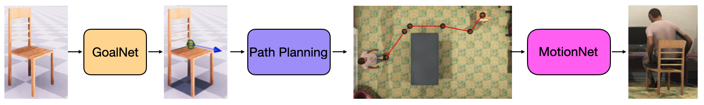

## Stochastic Scene-Aware Motion Prediction

[[Project Page](https://samp.is.tue.mpg.de/)]
[[Paper](https://ps.is.tuebingen.mpg.de/uploads_file/attachment/attachment/652/samp.pdf)]


## Description
This repository contains the training code for `MotionNet` and `GoalNet` of [SAMP](https://samp.is.tue.mpg.de/).

## Installation 
To install the necessary dependencies run the following command:
```shell
    pip install -r requirements.txt
```
The code has been tested with Python 3.8.10, CUDA 10.0, CuDNN 7.5 and PyTorch 1.7.1 on Ubuntu 20.04. 

## Training Data
The training data for `MotionNet` and `GoalNet` could be found in the [website downloads](https://samp.is.tue.mpg.de/). Or could be extracted
from the Unity runtime [code](https://github.com/mohamedhassanmus/SAMP).

Update `data_dir` parameter in the config files `cfg_files\MotionNet.yaml` and `cfg_files\GoalNet.yaml` to where your data is placed. 
By default it is set to `~\SAMP_workspace\data\MotionNet` and `~\SAMP_workspace\data\GoalNet`.

The training features of `MotionNet` and `GoalNet` are described in `Section 3.1` and `Section 3.2` of the [[Paper](https://ps.is.tuebingen.mpg.de/uploads_file/attachment/attachment/652/samp.pdf)] respectively. 
The character state `X` is described in `Equation 1`.

# Training 
To train `MotionNet` use:
```shell
    python src/MotionNet_train.py --config cfg_files/MotionNet.yaml
```

To train `GoalNet` use:
```shell
    python src/GoalNet_train.py --config cfg_files/GoalNet.yaml
```
Training `MotionNet` for 100 epochs takes `~5` hours on `Tesla V100-PCIE-32GB`. Training `GoalNet` should be done within `10` minutes.
## Loading the trained model to Unity
After training; the `PyTorch` model need to be converted to `ONNX` in order to be used in Unity. Check [https://onnx.ai/](https://onnx.ai/) 
for more details about `ONNX`. In Unity; we will use `Barracuda` which is an inference library which can load `ONNX` models into Unity. More details about Barracuda [here](https://docs.unity3d.com/Packages/com.unity.barracuda@1.0/manual/index.html).

```shell
    python src/Torch2ONNX.py --config cfg_files/MotionNet.yaml --load_checkpoint 100
```

```shell
    python src/Torch2ONNX.py --config cfg_files/GoalNet.yaml --load_checkpoint 100
```
## Saving norm data
The normalization data is used during training and inference. To save normalization data use the following
```shell
    python src/save_norm_data.py --config cfg_files/MotionNet.yaml
```
or
```shell
    python src/save_norm_data.py --config cfg_files/GoalNet.yaml
```

Note that this might take couple of minutes as the script loads the whole training data.

## License
1.	You may use, reproduce, modify, and display the research materials provided under this license (the “Research Materials”) solely for noncommercial purposes. Noncommercial purposes include academic research, teaching, and testing, but do not include commercial licensing or distribution, development of commercial products, or any other activity which results in commercial gain. You may not redistribute the Research Materials.
2.	You agree to (a) comply with all laws and regulations applicable to your use of the Research Materials under this license, including but not limited to any import or export laws; (b) preserve any copyright or other notices from the Research Materials; and (c) for any Research Materials in object code, not attempt to modify, reverse engineer, or decompile such Research Materials except as permitted by applicable law.
3.	THE RESEARCH MATERIALS ARE PROVIDED “AS IS,” WITHOUT WARRANTY OF ANY KIND, AND YOU ASSUME ALL RISKS ASSOCIATED WITH THEIR USE. IN NO EVENT WILL ANYONE BE LIABLE TO YOU FOR ANY ACTUAL, INCIDENTAL, SPECIAL, OR CONSEQUENTIAL DAMAGES ARISING OUT OF OR IN CONNECTION WITH USE OF THE RESEARCH MATERIALS.

## Citation
If you find this Model & Software useful in your research we would kindly ask you to cite:
```
@inproceedings{hassan_samp_2021,
  title = {Stochastic Scene-Aware Motion Prediction},
  author = {Hassan, Mohamed and Ceylan, Duygu and Villegas, Ruben and Saito, Jun and Yang, Jimei and Zhou, Yi and Black, Michael},
  booktitle = {Proceedings of the International Conference on Computer Vision 2021},
  month = oct,
  year = {2021},
  event_name = {International Conference on Computer Vision 2021},
  event_place = {virtual (originally Montreal, Canada)},
  month_numeric = {10}
}
```